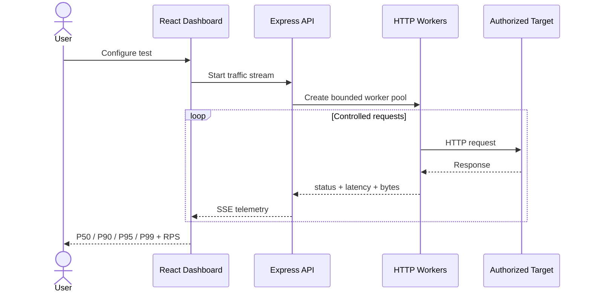
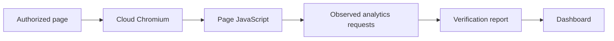

<div align="center">

# ⚡ CLICKHEAD

### HTTP Traffic Testing & Load Diagnostics

Controlled request pacing, configurable concurrency, live telemetry, a standalone test bench, and an optional browser-based analytics verification mode.

</div>

---

## Overview

**ClickHead** is a focused HTTP traffic-testing and diagnostics tool for developers and operators who need to understand how an authorized website or service behaves under controlled request volume.

It supports configurable request counts, concurrency, pacing, jitter, multi-path journeys, latency percentiles, graceful cancellation, live SSE telemetry, a standalone request counter, and browser-based analytics verification through a cloud Chromium session.

> Use it only against systems you own or are explicitly authorized to test.

## 🔄 Request & Telemetry Flow



**How to read it:** ClickHead generates bounded traffic, measures the resulting responses, and streams observations back to the dashboard. The test engine does not attempt to disguise synthetic traffic as humans.

## 🧪 Browser Verification Flow



Browser mode is for **verification**, not view inflation: it observes what analytics requests actually fire and does not guarantee provider-side counting.

## Features

- **Controlled pacing** — base delay plus jitter, including explicit zero-delay tests.
- **Concurrency limits** — bounded worker-pool execution.
- **Multi-page journeys** — configured public paths with destination validation.
- **Request telemetry** — status, latency, bytes, success/failure, RPS and P50/P90/P95/P99.
- **Safe redirects** — every redirect destination is revalidated.
- **Graceful shutdown** — stop active tests cleanly.
- **Browser QA** — optional real Chromium analytics verification.
- **Standalone test bench** — validate counters against a controlled endpoint.
- **Go client source** — generate Go client source for independent execution.

## Load Profiles

| Profile | Purpose |
|---|---|
| **Quick Verify** | Fast confirmation that an authorized endpoint responds |
| **15-Min Spread** | Small sustained request stream |
| **1-Hour Flow** | Controlled steady pacing |
| **6-Hour Daytime** | Extended diagnostic window |
| **24-Hour Diurnal** | Long-running diagnostics with a daily pacing curve |

## HTTP Test API

```text
GET /api/traffic/stream
```

| Parameter | Default | Description |
|---|---:|---|
| `targetUrl` | — | Authorized HTTP/HTTPS target |
| `totalRequests` | `20` | Number of requests, up to 2000 |
| `concurrency` | `3` | Parallel workers, up to 50 |
| `delayMs` | `1000` | Base delay per worker |
| `jitterMs` | `500` | Maximum randomized delay |
| `timeoutSeconds` | `10` | Per-request timeout |
| `enableMultiPage` | `false` | Enable configured path selection |
| `subPaths` | `/` | Relative or absolute public paths |

## Test Bench

- `/test-page`
- `/api/test/visit`
- `/api/test/stats`
- `/api/test/batch-visit`

The test bench explicitly identifies traffic as synthetic test traffic.

## Architecture

```text
[ React Dashboard ]
        │
        ├── configuration
        ├── live SSE telemetry
        └── browser verification
                 │
                 ▼
          [ Express API ]
                 │
        ┌────────┴────────┐
        ▼                 ▼
 [ HTTP Test Workers ]  [ Browserbase ]
        │                 │
        ▼                 ▼
 [ Target Service ]   [ Real Chromium ]
```

The production API runs as a Vercel function. Browser verification uses Browserbase; ordinary HTTP tests use server-side `fetch` with bounded concurrency, timeouts and redirect validation.

## Project Structure

```text
ClickHead/
├── api/                 # Production Express/Vercel API
├── src/                 # React dashboard
├── public/
├── server.ts
├── vercel.json
└── package.json
```

## Safety & Use

ClickHead is intended for legitimate performance testing, diagnostics, development, QA, and infrastructure validation. Always obtain authorization before generating load against a system you do not control.

> **ClickHead · A `.dot` microtool**
